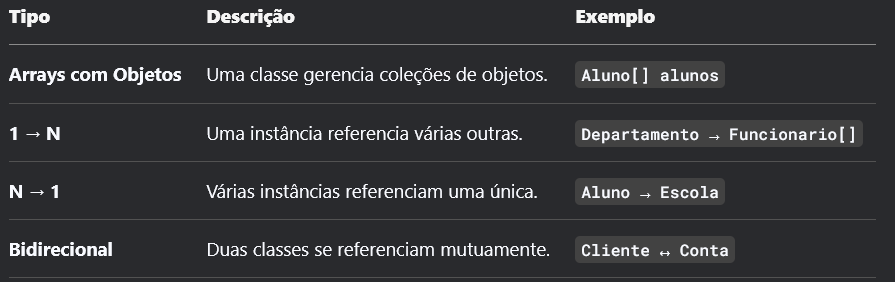

********# Maratona Java ☕
Nesse repositório eu busco documentar meu aprendizado e evolução durante minha rotina de estudos da linguagem Java.

Estou usando como meio de estudo o curso online de Java disponibilizado pelo canal [DevDojo](https://youtube.com/playlist?list=PL62G310vn6nFIsOCC0H-C2infYgwm8SWW&si=6YcxOOm5Ft0dyOFG).
****
## Aula 01 (Compilação Java)
Essa aula apresentou conceitos básicos da linguagem, principalmente como funcionava sua compilação.


## Aula 02 e 03 (Tipos Primitivos)
 Em Java os tipos primitivos são os dados básicos não orientados a objetos e armazenados diretamente na memória, utilizados em operações aritméticas e lógicas. 
 
Aqui foram apresentados os 8 tipos primitivos do Java:

1. **byte:** Utilizado pra economizar memória em operações com números pequenos.
2. **short:** Similar ao byte, porém tem um intervalo maior.
3. **int:** Tipo padrão para números inteiros.
4. **long:** Utilizado para números inteiros muito grandes. É declarado com um L no final do número (ex: `1241414211443L`)
5. **float:** Utilizado para números decimais de precisão moderada. É declarado com F no final. (ex:`3.14F`)
6. **double:** Assim como o float é utilizado para números decimais, porém como uma maior precisão, alcançando um maior intervalo. 
7. **char:** Utilizado para armazenar um **único** caractere unicode (ex:`'A' = \u0041'` ) 
8. **boolean:** Uso em lógicas e condicionais, o seu resultado sempre vai ser ou `true` ou `false`


## Aula 04 (Operadores)

### Operadores Aritméticos
- Utilizados para expressões matemáticas

1. `+`: adição
2. `-`: subtracação
3. `*`: multiplicação
4. `/`: divisão simples
5. `%`: resto da divisão

#### Exemplo:
- `int soma = n1 + n2;` // Soma de dois números
- `int resto = n1 % n2;` // Resto da divisão de n1 por n2

### Operadores Relacionais
- Fazem comparações para retornar valores boolenos

1. `>`: maior que
2. `<`: menor que
3. `==`: igual a
4. `!=`: diferente de
5. `>=`: maior igual a
6. `<=`: menor igual a 

#### Exemplo:
- `boolean isMaior = n1 > n2;` // Verifica se n1 é maior que n2
- `boolean isIgual = n1 == n2;` // Verifica se n1 é igual a n2

### Operadores Lógicos
- Utilizados para combinações de expressões booleanas mais complexas

1. `&& (AND)`: Para retornar true é necessário que todas as condições sejam verdadeiras
2. `|| (OR)`: É necessário apenas uma condição ser verdadeira para ele retornar true
3. `! (NOT)`: É utilizada para inverter o valor booleano

#### Exemplo:
- `boolean isPermitido = idade >= 18 && saldo >= 500;` // Verifica se a idade é >= 18 E o saldo é >= 500
- `boolean isCompravel = saldo1 >= valor || saldo2 >= valor;` // Verifica se o valor é comprável com um dos saldos

### Operadores de Atribuição
- Utilizados para facilitar a atribuições de valores a variáveis, combinando um operador aritmético com o sinal de atribuição(`=`)

#### Exemplo:
- `saldo += 1000;` // Adiciona 1000 ao saldo atual

### Operadores de Incremento e Decremento
- Aumenta ou diminui o valor de uma variável em uma unidade 

- `++`: Incremento
- `--`: Decremento 

#### Exemplo:
- `contador++;` // Incrementa o contador em 1 
  - **OBS:** A ordem de utilização do operador afeta o resultado:
    - `++contador`: Incrementa o valor **antes** da utilização
    - `contador++`: Incrementa o valor **após** a utilização

## Aula 05 (Estruturas Condicionais)
- As estruturas condicionais permitem que o programa tome decições a partir de condições estabelecidas.

### Estrutura IF

- Executa o código caso a condição seja verdadeira
  - Sintaxe: 
      ```java
      if (condicao) {
        // código a ser executado
        }
      ```

### Estrutura IF-ELSE

- Executa um bloco de código caso a condição seja verdadeira e outro caso ela seja falsa 
  - Sintaxe: 
      ```java
        if (condicao) {
              // código executado se for VERDADEIRA
        } 
        else {
              // código executado se for FALSA
        }
      ```

### Operador Ternário 

- É uma meneira de comprimir a estrutura IF-ELSE em apenas uma linha
  - Sintaxe: `(condicao) ? valorSeVerdadeiro : valorSeFalso;`

### Estrutura IF-ELSE para múltiplas condições

- Ele vai avaliar mais de duas condições e retornar a primeira verdadeira
  - Sintaxe: 
       ``` java
      if (condicao1) {
           código executado se condicao1 for verdadeira
      } else if (condicao2) {
          // código executado se condicao2 for verdadeira
      } else {
          // código executado se nenhuma das condições anteriores for verdadeira}
      ```
### Estrutura Switch

O `switch` é uma alternativa para simplificar condições encadeadas (como `if-else`), especialmente quando se compara **uma única variável** contra múltiplos valores.

### **Sintaxe Básica**
```java
switch (variável) {
    case valor1:
        // Código se variável == valor1
        break;
    case valor2:
        // Código se variável == valor2
        break;
    default:
        // Código se nenhum case for atendido
}
```
## Aula 06 (Estruturas de Repetição)

### Estrutura While
- Executa um bloco de código enquanto uma condição for verdadeira.
- **Uso ideal:** Quando não se sabe quantas iterações serão necessárias (ex.: ler entradas até que o usuário digite "sair").
- **Cuidado:** Condições mal formuladas podem causar loops infinitos!
#### **Sintaxe Básica**
```java
int contador = 0;
while (contador < 5) {
    System.out.println("Contagem: " + contador);
    contador++;
}
```

### Estrutura Do-While
- Similar ao while, mas garante pelo menos uma execução (a condição é verificada no final).
- Uso ideal: Menus interativos ou validação de entrada.

#### **Sintaxe Básica**
```java
int numero;
do {
    System.out.println("Digite um número positivo:");
    numero = scanner.nextInt();
} while (numero <= 0);
```

### Estrutura For
- Estrutura compacta para loops com contador controlado.
- Componentes:
  - Inicialização: int i = 0 (executa uma vez).

  -  Condição: i < 10 (verificada a cada iteração).

  -  Incremento: i++ (executa após cada ciclo).
- Uso ideal: Iterações com número definido (ex.: percorrer arrays).

#### **Sintaxe Básica**
```java
for (int i = 0; i < 10; i++) {
    System.out.println("Número: " + i);
}
```

### Estrutura Foreach
- Simplifica a iteração em coleções (arrays, listas, etc.).
- Vantagem: Elimina a necessidade de contadores manual.
- Limitação: Não permite modificar a coleção durante a iteração.

#### **Sintaxe Básica**
```java
String[] frutas = {"Maçã", "Banana", "Pêra"};
for (String fruta : frutas) {
    System.out.println("Fruta: " + fruta);
}
```

### ⚠️ Dicas Importantes

- Evite loops infinitos: Sempre atualize a variável de condição!

- break e continue: Use para sair prematuramente (break) ou pular iterações (continue).

#### **Sintaxe Básica**
```java
for (int i = 0; i < 10; i++) {
    if (i == 5) break; // Sai do loop quando i for 5
    if (i % 2 == 0) continue; // Pula números pares
    System.out.println("Ímpar: " + i);
}
```

## Aula 07 e 08 (Arrays e Arrays Multidimensionais)
- Estruturas para armazenar múltiplos valores do mesmo tipo em uma única variável.

### 1. Declaração e Inicialização
```java
// Forma 1: Declaração + tamanho  
int[] numeros = new int[5]; // [0, 0, 0, 0, 0]  

// Forma 2: Declaração com valores iniciais  
String[] frutas = {"Maçã", "Banana", "Pêra"};  
```
- Tamanho fixo: Definido na criação e não pode ser alterado.

- Valores padrão:

  - 0 para números.

  - null para objetos.

### 2. Acesso e Modificação

````java
numeros[0] = 10; // Atribui valor à posição 0  
System.out.println(frutas[1]); // Imprime "Banana"  
````
- Índices: Começam em 0.

- Erro comum: ArrayIndexOutOfBoundsException (tentar acessar índice inválido).

### 3. Percorrendo Arrays

#### Com for tradicional
````java
  for (int i = 0; i < numeros.length; i++) {
        System.out.println("Posição " + i + ": " + numeros[i]);  
}  
````

#### Com foreach
````java
for (String fruta : frutas) {  
    System.out.println(fruta);  
}  
````
- .length: Propriedade que retorna o tamanho do array.

### 4. Arrays Multidimensionais

````java
// Matriz 2x3  
int[][] matriz = {  
    {1, 2, 3},  
    {4, 5, 6}  
};  
System.out.println(matriz[1][2]); // Imprime 6  
````
- Uso comum: Tabelas, grids ou estruturas com linhas/colunas.


# Programação Orientada à Objetos (POO)

## Classes e Métodos
-  **Classes(dados)**: são meio que um molde que define caractéristicas de um objeto (ex: cor, nome, idade) 
- **Métodos(ações)**: são as funções que um objeto pode realizar (ex: acelerar, imprimir)
````java
public class Carro {  
    // Atributos (propriedades)  
    String modelo;  
    int ano;  
    String cor;  

    // Método (ação)  
    void acelerar() {  
        System.out.println("Acelerando o " + modelo + "!");  
    }  
}
````
### Como instanciar classes
- Instanciar significa criar um objeto a partir de uma classe. É como pegar a "receita" (a classe) e usar ela para fazer um "bolo" (o objeto).

````java
NomeDaClasse nomeDoObjeto = new NomeDaClasse();
````

### Tipos de métodos

#### Sem retorno (void):
- Métodos como esse não retornam um valor, geralmente são usados para imprimir algo.
````java
void dizerOla() {  
    System.out.println("Olá, mundo!");  
}  
````

#### Com retorno:
- Dessa forma o método retorna o valor resultante, é imporante lembrar que **retornar** é diferente de **imprimir**.
````java
int somar(int a, int b) {  
    return a + b;  
}  
````
## Getters e Setters 
- Os métodos getters e setters são usados para controlar o acesso aos atributos de uma classe, seguindo o princípio do encapsulamento (um dos pilares da POO).

### Por que não usar atributos públicos?
- Forma errada❌ :
````java
public class Pessoa {  
    public String nome; // Risco: Qualquer um pode modificar diretamente!  
}  

// Uso perigoso:  
Pessoa p = new Pessoa();  
p.nome = ""; // Nome vazio? Isso não deveria ser permitido! 
````

- Solução com Getters and Setters✅:
````java
public class Pessoa {  
    private String nome; // Atributo PRIVADO (só a própria classe acessa)  

    // Getter (obter valor)  
    public String getNome() {  
        return this.nome;  
    }  

    // Setter (atribuir valor)  
    public void setNome(String nome) {  
        if (nome != null && !nome.isEmpty()) { // Validação!  
            this.nome = nome;  
        } else {  
            System.out.println("Nome inválido!");  
        }  
    }  
}  

````

### Como usar getters/setters:
````java
public class Main {  
    public static void main(String[] args) {  
        Pessoa pessoa = new Pessoa();  

        pessoa.setNome("João"); // Válido  
        System.out.println(pessoa.getNome()); // "João"  

        pessoa.setNome(""); // Inválido → "Nome inválido!"  
    }  
}  
````
### Padrão de Nomenclatura
- Getter: get + nome do atributo (ex.: getNome()).

- Setter: set + nome do atributo (ex.: setNome(String nome)).

- Para booleanos, use is em vez de get:
````java
public boolean isAtivo() {  
    return this.ativo;  
}  
````

## Sobrecarga de métodos
- A sobrecarga de métodos permite que uma classe tenha vários métodos com o mesmo nome, mas com parâmetros diferentes

### Regras da Sobrecarga

- Mesmo nome para os métodos.

- Lista de parâmetros diferentes (pode variar em: quantidade, tipo ou ordem).

- O retorno não importa (pode ser igual ou diferente).

### Exemplo de métodos sobrecarregados:

````java
public void init(String nome, String tipo, int episodios) {  
    this.nome = nome;  
    this.tipo = tipo;  
    this.episodios = episodios;  
}  

// Sobrecarga: Adiciona parâmetro "genero"  
public void init(String nome, String tipo, int episodios, String genero) {  
    this.init(nome, tipo, episodios); // Reaproveita o init anterior  
    this.genero = genero;  
}  
````
#### Sendo utilizados na prática:
````java
Anime anime1 = new Anime();  
anime1.init("Naruto", "Anime", 220); // Chama o init de 3 parâmetros  

Anime anime2 = new Anime();  
anime2.init("Attack on Titan", "Anime", 75, "Ação"); // Chama o init de 4 parâmetros  
````

### Por que é importante utilizar sobrecarga?
- A utilização de sobrecarga além de evitar a criação de novos métodos com a mesma funcionalidade, permite chamar o método de diferentes formas, além disso ainda possibilita o reaproveitamente de código (Ex: o init de 4 parâmetros chamando o init de 3 parâmetros)

## Contrutores
- Os construtores são métodos especiais usados para inicializar objetos quando eles são criados com new. Eles têm o mesmo nome da classe e não possuem tipo de retorno (nem mesmo void).

##### Características:
- São chamados automaticamente quando o objeto é instanciado (new Anime()).

- Podem ser sobrecarregados (vários construtores com parâmetros diferentes, assim como os métodos).

- Se não for declarado, o Java cria um construtor padrão vazio.

###  Tipos de Construtores utilizados no código:
### 1. Construtor Padrão (Sem Argumentos)7
````java
public Anime() {  
    System.out.println("sem argumentos");  
}  
````
#### - uso:
````java
Anime anime1 = new Anime(); // Imprime "sem argumentos"  
````
### 2. Construtor com 4 Parâmetros
````java
public Anime(String nome, String tipo, int episodios, String genero) {  
    this(); // Chama o construtor padrão (DEVE SER A PRIMEIRA LINHA!)  
    this.nome = nome;  
    this.tipo = tipo;  
    this.episodios = episodios;  
    this.genero = genero;  
}  
````
#### - uso:
````java
Anime anime2 = new Anime("Naruto", "Mangá", 100, "Shounen");  
````
### **3. Construtor com 5 Parâmetros**
````java
public Anime(String nome, String tipo, int episodios, String genero, String estudio) {  
    this(nome, tipo, episodios, genero); // Reaproveita o construtor de 4 parâmetros  
    this.estudio = estudio;  
}   
````
#### - uso:
````java
Anime anime3 = new Anime("Naruto", "Mangá", 100, "Shounen", "Ghibli");  
````

## Blocos de Inicialização, static, Métodos Estáticos e Bloco Estático

### 1. Bloco de Inicialização

- **O que é?** Um bloco de código que é executado antes do construtor, toda vez que um objeto é criado.

- **Para que serve?** Inicializar atributos ou executar lógicas comuns a todos os construtores.

````java
public class Anime {  
    private String nome;  
    
    // Bloco de inicialização (executa antes de qualquer construtor)  
    {  
        System.out.println("Dentro do bloco de inicialização");  
        nome = "Naruto"; // Valor padrão  
    }  

    public Anime() {  
        System.out.println("Dentro do construtor");  
    }  
}  

// Teste:  
Anime anime = new Anime();  
/* Saída:  
   Dentro do bloco de inicialização  
   Dentro do construtor  
*/  
````

### 2. Modificador static

- **O que faz?** Indica que um atributo ou método pertence à classe, não a objetos individuais.

- **Características:**
  - Atributos static são compartilhados por todas as instâncias.

  - Métodos static não podem acessar atributos não estáticos (pois não dependem de objetos).

````java
public class Contador {  
    public static int total; // Atributo estático (compartilhado)  

    public Contador() {  
        total++; // Incrementa o contador toda vez que um objeto é criado  
    }  

    public static void imprimirTotal() { // Método estático  
        System.out.println("Total de objetos: " + total);  
    }  
}  

// Teste:  
new Contador();  
new Contador();  
Contador.imprimirTotal(); // Saída: "Total de objetos: 2"  
````

### 3. Métodos Estáticos

- **O que são?** Métodos que não precisam de instância para serem chamados.
- **Uso comum:** Utilitários (ex.: Math.sqrt()).

````java
public class Calculadora {  
    public static double somar(double a, double b) {  
        return a + b;  
    }  
}  

// Chamada sem criar objeto:  
double resultado = Calculadora.somar(5, 3); // 8.0  
````

### 4. Bloco de Inicialização Estático

- **O que é?** Um bloco que executa uma única vez, quando a classe é carregada na JVM.

- **Para que serve?** Inicializar atributos estáticos.

````java
public class Config {  
    public static String DATA_CARREGAMENTO;  

    // Bloco estático (executa quando a classe é carregada)  
    static {  
        DATA_CARREGAMENTO = LocalDateTime.now().toString();  
        System.out.println("Bloco estático executado!");  
    }  
}  

// Teste:  
System.out.println(Config.DATA_CARREGAMENTO);  
// Saída: "Bloco estático executado!" + data atual  
````

### Dicas Finais

- **static:** Use para constantes (public static final) ou métodos utilitários.

- **Blocos estáticos:** Inicialize recursos pesados (ex.: conexão com banco de dados).

- Evite abusar de static (pode dificultar testes e aumentar acoplamento).


## Associação

### 1. Arrays com Objetos
- Arrays podem armazenar objetos, permitindo trabalhar com coleções de instâncias.

````java
public class Aluno {
    private String nome;
    
    public Aluno(String nome) {
        this.nome = nome;
    }
    
    public String getNome() {
        return nome;
    }
}

public class Escola {
    public static void main(String[] args) {
        Aluno[] alunos = new Aluno[3];
        alunos[0] = new Aluno("João");
        alunos[1] = new Aluno("Maria");
        alunos[2] = new Aluno("Pedro");
        
        for(Aluno aluno : alunos) {
            System.out.println(aluno.getNome());
        }
    }
}
````

### 2. Associação Unidirecional (Um para Muitos)
- Uma classe contém referências a múltiplas instâncias de outra classe.
#### Exemplo: Departamento → Funcionários
````java
public class Funcionario {
    private String nome;
    
    public Funcionario(String nome) {
        this.nome = nome;
    }
    
    public String getNome() {
        return nome;
    }
}

public class Departamento {
    private String nome;
    private Funcionario[] funcionarios;
    
    public Departamento(String nome, Funcionario[] funcionarios) {
        this.nome = nome;
        this.funcionarios = funcionarios;
    }
    
    public void listarFuncionarios() {
        System.out.println("Departamento: " + nome);
        for(Funcionario f : funcionarios) {
            System.out.println("- " + f.getNome());
        }
    }
}

public class Main {
    public static void main(String[] args) {
        Funcionario[] funcs = {
            new Funcionario("Carlos"),
            new Funcionario("Ana")
        };
        
        Departamento rh = new Departamento("RH", funcs);
        rh.listarFuncionarios();
    }
}
````

### 3. Associação Unidirecional (Muitos para Um)
- Múltiplas instâncias de uma classe referenciam uma única instância de outra.
#### Exemplo: Alunos → Escola

````java
public class Escola {
    private String nome;
    
    public Escola(String nome) {
        this.nome = nome;
    }
    
    public String getNome() {
        return nome;
    }
}

public class Aluno {
    private String nome;
    private Escola escola; // Muitos alunos para uma escola
    
    public Aluno(String nome, Escola escola) {
        this.nome = nome;
        this.escola = escola;
    }
    
    public void mostrarEscola() {
        System.out.println(nome + " estuda em " + escola.getNome());
    }
}

public class Main {
    public static void main(String[] args) {
        Escola etec = new Escola("ETEC Zona Leste");
        
        Aluno a1 = new Aluno("João", etec);
        Aluno a2 = new Aluno("Maria", etec);
        
        a1.mostrarEscola();
        a2.mostrarEscola();
    }
}
````

### 4. Associação Bidirecional
- Duas classes se referenciam mutuamente.
#### Exemplo: Cliente ↔ Conta Bancária

````java
public class Cliente {
    private String nome;
    private Conta conta;
    
    public Cliente(String nome) {
        this.nome = nome;
    }
    
    public void setConta(Conta conta) {
        this.conta = conta;
    }
    
    public void mostrarConta() {
        System.out.println("Cliente: " + nome);
        System.out.println("Saldo: R$" + conta.getSaldo());
    }
}

public class Conta {
    private double saldo;
    private Cliente cliente;
    
    public Conta(double saldo) {
        this.saldo = saldo;
    }
    
    public void setCliente(Cliente cliente) {
        this.cliente = cliente;
        cliente.setConta(this); // Estabelece a relação bidirecional
    }
    
    public double getSaldo() {
        return saldo;
    }
}

public class Main {
    public static void main(String[] args) {
        Cliente cli = new Cliente("José");
        Conta cc = new Conta(1500.0);
        
        cc.setCliente(cli); // Liga os dois objetos
        
        cli.mostrarConta();
    }
}
````

### Resumo dos Tipos de Associação 


## 📌 Sobrescrita de Métodos (Override)

  A sobrescrita permite que uma subclasse forneça uma implementação específica de um método já existente na superclasse.

Regras da Sobrescrita:

- O método deve ter a mesma assinatura (nome, parâmetros e tipo de retorno).

- Não pode ter um modificador de acesso mais restritivo que o método original.

- Usa a anotação @Override para garantir que está sobrescrevendo corretamente.

Exemplo no Código:

```java
public class Anime {
    private String nome;

    @Override // Indica que está sobrescrevendo o método toString() da classe Object
    public String toString() {
        return this.nome; // Retorna o nome do anime em vez do endereço de memória
    }
}

//Uso

Anime anime = new Anime("Naruto");
System.out.println(anime); // Saída: "Naruto" (invoca toString() sobrescrito)
```

### Por que sobrescrever toString()?

- Por padrão, System.out.println(objeto) chama Object.toString(), que retorna o endereço de memória (ex: Anime@1a2b3c).   
- Sobrescrevendo, você controla o que será exibido.


## 🔧 Modificador final

O modificador final pode ser aplicado a:

- Variáveis: Transforma em constantes (valor não pode ser alterado).

- Métodos: Impede a sobrescrita em subclasses.

- Classes: Impede que a classe seja herdada.

### 1. Variáveis final (Constantes)

  - Convenção: Nome em MAIÚSCULAS com _.

  - Devem ser inicializadas na declaração ou no construtor.
   
  
- Características:

    - VELOCIDADE_LIMITE é uma constante estática (acessível via Carro.VELOCIDADE_LIMITE).

    - COMPRADOR é uma referência final:

    - A referência não pode apontar para outro objeto (COMPRADOR = novoComprador; → Erro).

    - Mas os atributos internos do objeto podem ser modificados (COMPRADOR.setNome("Novo Nome") → OK).


### 2. Métodos final

- Métodos marcados como final não podem ser sobrescritos.

- Útil para garantir que um comportamento não seja alterado por subclasses.

### 3. Classes final

- Classes final não podem ser herdadas.

- Exemplo clássico: String no Java.

### 💡 Dicas Importantes

#### final vs. Imutabilidade:

- final garante que a referência não muda, mas não torna o objeto imutável.

- Para imutabilidade, todos os campos do objeto também devem ser final e sem setters (ex: String).

#### Quando usar final?

- Em constantes (como VELOCIDADE_LIMITE).

- Em métodos críticos que não devem ser alterados.

- Em classes utilitárias (ex: Math).