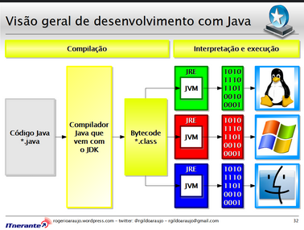

# Maratona Java
Nesse repositório eu busco documentar meu aprendizado e evolução durante minha rotina de estudos da linguagem Java.

Estou usando como meio de estudo o curso online de Java disponibilizado pelo canal [DevDojo](https://youtube.com/playlist?list=PL62G310vn6nFIsOCC0H-C2infYgwm8SWW&si=6YcxOOm5Ft0dyOFG).

## Aula 01 (Compilação Java)
Essa aula apresentou conceitos básicos da linguagem, principalmente como funcionava sua compilação.



## Aula 02 (Tipos Primitivos)
 Em Java os tipos primitivos são os dados básicos não orientados a objetos e armazenados diretamente na memória, utilizados em operações aritméticas e lógicas. 
 
Aqui foram apresentados os 8 tipos primitivos do Java:

1. **byte:** Utilizado pra economizar memória em operações com números pequenos.
2. **short:** Similar ao byte, porém tem um intervalo maior.
3. **int:** Tipo padrão para números inteiros.
4. **long:** Utilizado para números inteiros muito grandes. É declarado com um L no final do número (ex: `1241414211443L`)
5. **float:** Utilizado para números decimais de precisão moderada. É declarado com F no final. (ex:`3.14F`)
6. **double:** Assim como o float é utilizado para números decimais, porém como uma maior precisão, alcançando um maior intervalo. 
7. **char:** Utilizado para armazenar um **único** caractere unicode (ex:`'A' = \u0041'` ) 
8. **boolean:** Uso em lógicas e condicionais, o seu resultado sempre vai ser ou `true` ou `false`


## Aula 04 (Operadores)

### Operadores Aritméticos
- Utilizados para expressões matemáticas

1. `+`: adição
2. `-`: subtracação
3. `*`: multiplicação
4. `/`: divisão simples
5. `%`: resto da divisão

#### Exemplo:
- `int soma = n1 + n2;` // Soma de dois números
- `int resto = n1 % n2;` // Resto da divisão de n1 por n2

### Operadores Relacionais
- Fazem comparações para retornar valores boolenos

1. `>`: maior que
2. `<`: menor que
3. `==`: igual a
4. `!=`: diferente de
5. `>=`: maior igual a
6. `<=`: menor igual a 

#### Exemplo:
- `boolean isMaior = n1 > n2;` // Verifica se n1 é maior que n2
- `boolean isIgual = n1 == n2;` // Verifica se n1 é igual a n2

### Operadores Lógicos
- Utilizados para combinações de expressões booleanas mais complexas

1. `&& (AND)`: Para retornar true é necessário que todas as condições sejam verdadeiras
2. `|| (OR)`: É necessário apenas uma condição ser verdadeira para ele retornar true
3. `! (NOT)`: É utilizada para inverter o valor booleano

#### Exemplo:
- `boolean isPermitido = idade >= 18 && saldo >= 500;` // Verifica se a idade é >= 18 E o saldo é >= 500
- `boolean isCompravel = saldo1 >= valor || saldo2 >= valor;` // Verifica se o valor é comprável com um dos saldos

### Operadores de Atribuição
- Utilizados para facilitar a atribuições de valores a variáveis, combinando um operador aritmético com o sinal de atribuição(`=`)

#### Exemplo:
- `saldo += 1000;` // Adiciona 1000 ao saldo atual

### Operadores de Incremento e Decremento
- Aumenta ou diminui o valor de uma variável em uma unidade 

- `++`: Incremento
- `--`: Decremento 

#### Exemplo:
- `contador++;` // Incrementa o contador em 1 
  - **OBS:** A ordem de utilização do operador afeta o resultado:
    - `++contador`: Incrementa o valor **antes** da utilização
    - `contador++`: Incrementa o valor **após** a utilização

## Aula 05 (Estruturas Condicionais)
- As estruturas condicionais permitem que o programa tome decições a partir de condições estabelecidas.

### Estrutura IF

- Executa o código caso a condição seja verdadeira
  - Sintaxe: 
      ```
      if (condicao) {
        // código a ser executado
        }
      ```

### Estrutura IF-ELSE

- Executa um bloco de código caso a condição seja verdadeira e outro caso ela seja falsa 
  - Sintaxe: 
      ```
        if (condicao) {
              // código executado se for VERDADEIRA
        } 
        else {
              // código executado se for FALSA
        }
      ```

### Operador Ternário 

- É uma meneira de comprimir a estrutura IF-ELSE em apenas uma linha
  - Sintaxe: `(condicao) ? valorSeVerdadeiro : valorSeFalso;`

### Estrutura IF-ELSE para múltiplas condições

- Ele vai avaliar mais de duas condições e retornar a primeira verdadeira
  - Sintaxe: 
       ``` 
      if (condicao1) {
           código executado se condicao1 for verdadeira
      } else if (condicao2) {
          // código executado se condicao2 for verdadeira
      } else {
          // código executado se nenhuma das condições anteriores for verdadeira}
      ```
